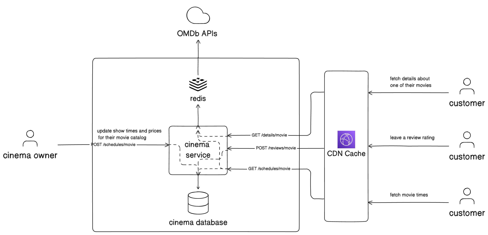

# Requirements
## Business requirements:
1. _**Cinema owners**_ can modify schedule and prices of the movies
2. _**Customers**_ can fetch schedule of the movies with internal rating
3. _**Customers**_ can fetch details of the movies (based on OMDb API)
4. _**Customers**_ can post reviews of movie

   
## Technical requirements:
1. There is daily limit od 1_000 calls towards OMDb API

## Architectural decisions records

**001 All customer-facing endpoints must be available only through CloudFront** 
* that protects system against DDOS attacks 
* `fetch details about one of their movies` endpoint is very static endpoint and can be cached on CDN cache for a very long time in order to reduce number of cals towards 3rd party API and reduce number of calls that are reaching the cinema-service
* `fetch movie times` can be cached, but for short period of time

**002 There is Redis cache used by the system**
* cache is used for caching responses from OMDb system 
* cache is used for caching movies schedules 

**003 Caches time:**
- `fetch details about one of their movies` - cached for 6h on CDN and for 12h in redis
- `fetch movie times` - cached for 1 minute on CDN and for 2 minutes in Redis

**004 Security**
* There are two roles in the system:
  * **User Role** for customers
  * **Admin role** for cinema owners
* System handles user registration, stores the user data and hashed password.

**005 Asynchronous processing of movies rates**
* In order to reduce processing time when fetching movies' rates, calculation of average rate per movie was moved to the background, asynchronous job.
* Job calculates new average per movie every X minutes (configurable)
* After submitting new rate by the customer, there might be a period of maximum X minutes, where internal rate that is served to all customers might be stale.
* Saving the rates (even though without calculating new average) is synchronous. In the future it might be also split into async job - like queue that takes the new rate and another job that saves it into the db later.
* Queue aproach was not implemented, as is looks like premature optimisation.
* 

# High-level architecture of the system

